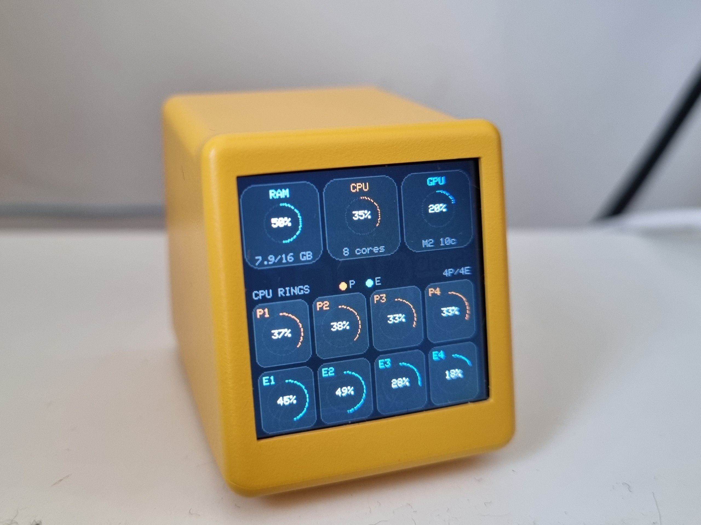
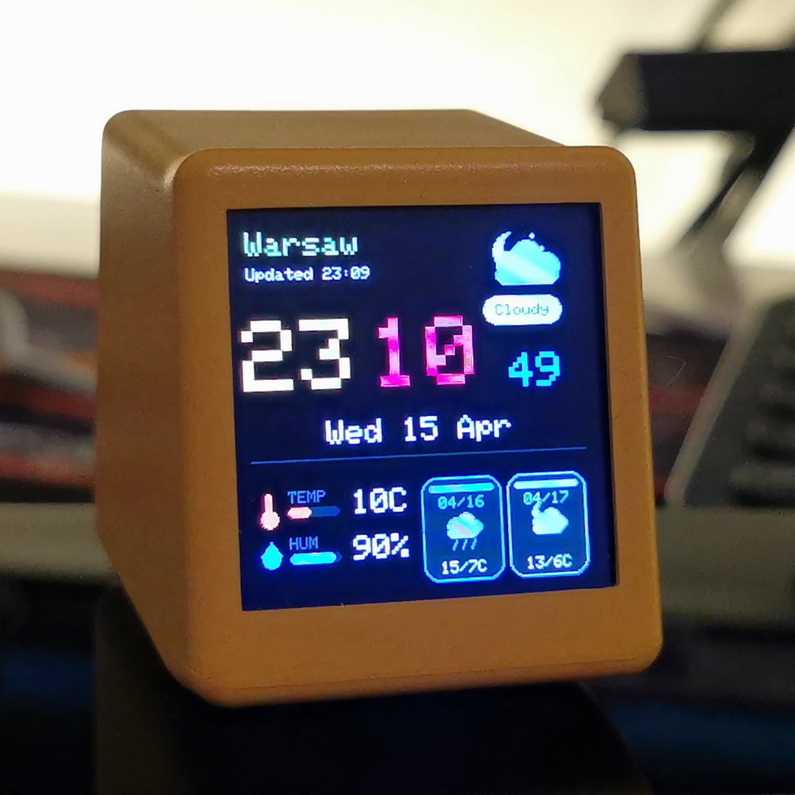
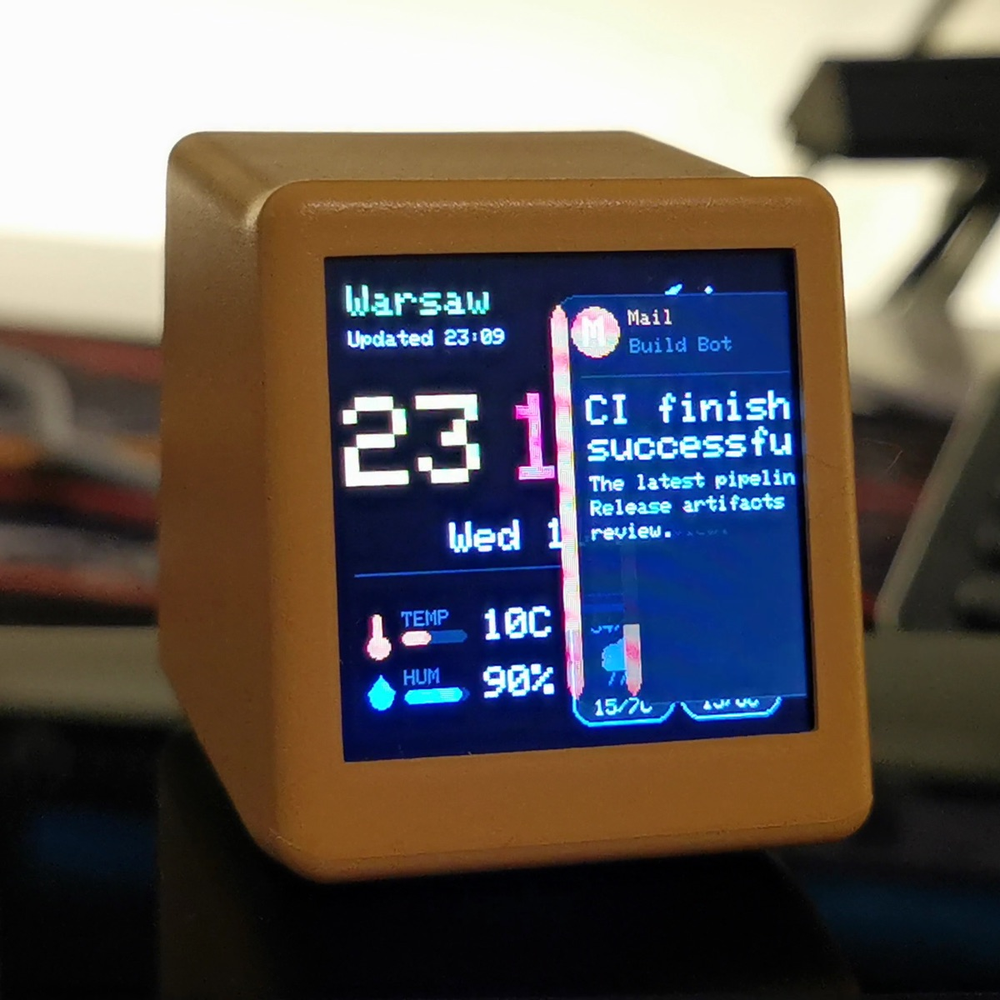
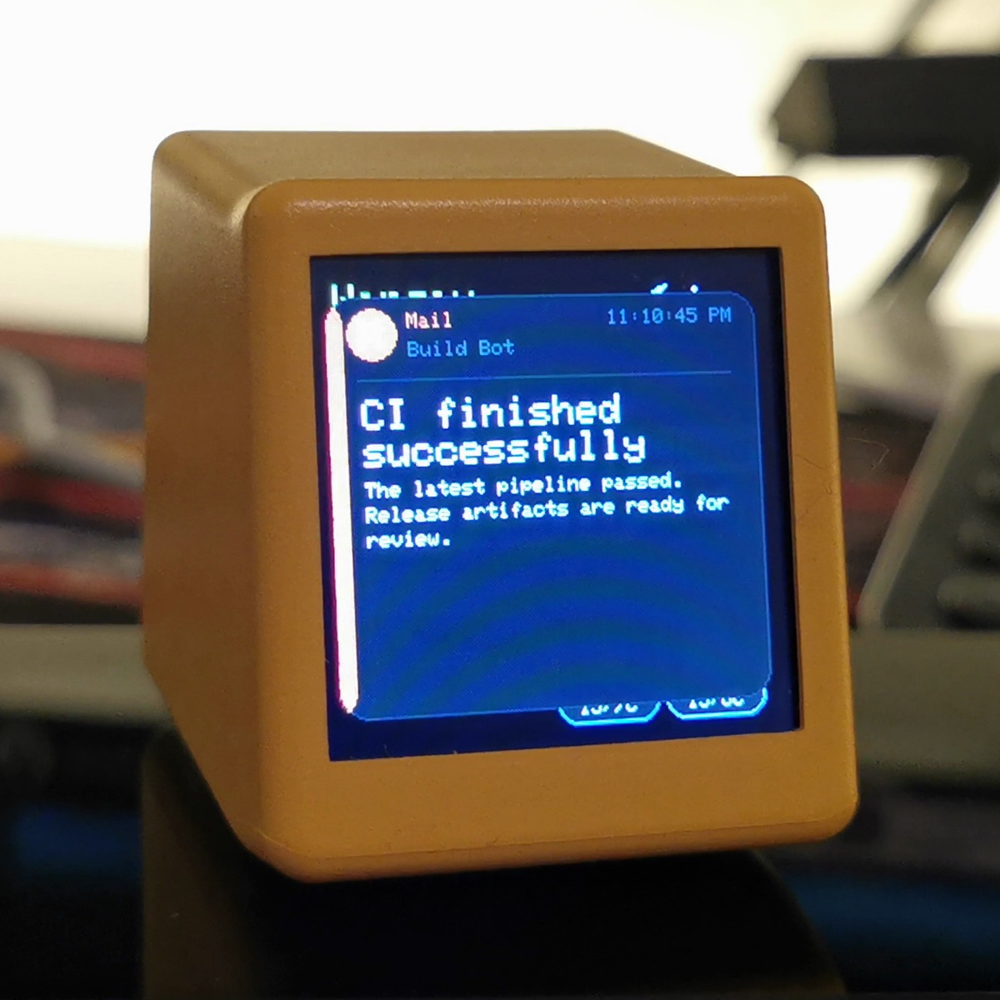

# esp-mini_screen

`ESP8266` `ESP12F` `ST7789` `WiFi` `Arduino` `macOS` `weather station` `system monitoring` `notifications` `dashboards` `TFT display` `IoT`

Custom firmware for the `GeekMagic SmallTV-Ultra`, an ESP12F-based mini desktop WiFi weather station with a 240x240 ST7789 TFT display.

On marketplaces such as Amazon, AliExpress, and similar shops it is commonly listed as: `Super Cool Mini WiFi Desktop Weather Digital Clock Station with IPS LCD Screen Gadget for Decoration`.

## Sketch Overview

### esp_mini_screen_mac_stats

Original Mac monitor sketch with RAM usage and per-core CPU bars grouped into `Performance` and `Efficiency` rows.


### esp_mini_screen_mac_stats_v2

Redesigned Mac monitor with circular `RAM` / `CPU` / `GPU` gauges on top and per-core rings below, styled closer to iStat Menus.



### esp_mini_screen_limits

Compact dashboard for daily/weekly `Codex` and `Claude` limits, updated over HTTP from macOS helper scripts.


### esp_mini_screen_notifications

Notification overlay sketch with an idle `clock + weather` dashboard underneath, plus slide-in / slide-out app cards over HTTP.

Currently `work in progress`: the device-side sketch is usable, but there is no companion desktop/mobile app yet.


| Idle clock + weather | Notification sliding in | Full notification card |
|---|---|---|
|  |  |  |

### Other sketches

- `esp_mini_screen_colors` - full-screen color test for verifying the TFT wiring and `User_Setup.h`
- `esp_mini_screen_wifi` - WiFi provisioning with captive portal and EEPROM storage
- `esp_mini_screen_camera` - live phone camera streaming over HTTPS to the TFT
- `esp_mini_screen_image` - browser-based single image upload and display
- `macos_ai_limits` - helper scripts for pushing local AI usage data to `esp_mini_screen_limits`

## Hardware

- ESP12F (ESP8266) module
- ST7789V 240x240 TFT display (SPI)
- CH340C soldered to the U3 socket on the back of the board for USB-C programming

### Display Pin Mapping

| Signal   | GPIO | Notes              |
|----------|------|--------------------|
| TFT_MOSI | 13   | HSPI               |
| TFT_SCLK | 14   | HSPI               |
| TFT_CS   | -1   | Tied to GND on PCB |
| TFT_DC   | 0    |                    |
| TFT_RST  | 2    |                    |
| TFT_BL   | 5    | Active LOW         |

## Prerequisites

1. **Arduino IDE** (1.8.x or 2.x)
2. **ESP8266 board support** — in Arduino IDE go to **File -> Preferences**, add this URL to *Additional Board Manager URLs*:
   ```
   http://arduino.esp8266.com/stable/package_esp8266com_index.json
   ```
   Then go to **Tools -> Board -> Boards Manager**, search for **esp8266** and install it.
3. **TFT_eSPI library** — go to **Sketch -> Include Library -> Manage Libraries**, search for **TFT_eSPI** by Bodmer and install it.

## Setup

### 1. Configure TFT_eSPI

The ST7789 display will **not** work with default library settings. You must replace the `User_Setup.h` file inside the TFT_eSPI library folder with the one provided in this repository.

Find the library folder (typical paths):

| OS      | Path                                                        |
|---------|-------------------------------------------------------------|
| macOS   | `~/Documents/Arduino/libraries/TFT_eSPI/User_Setup.h`      |
| Windows | `C:\Users\<you>\Documents\Arduino\libraries\TFT_eSPI\User_Setup.h` |
| Linux   | `~/Arduino/libraries/TFT_eSPI/User_Setup.h`                |

Copy `User_Setup.h` from this repo root and replace the original file.

### 2. Generate local TLS certificate (camera sketch)

`esp_mini_screen_camera` uses HTTPS for camera access and expects a local file `esp_mini_screen_camera/tls_local.h` with your private key.

Generate it once after cloning:

```bash
bash setup.sh
```

This creates a unique self-signed cert/key pair for your machine. The generated file is ignored by Git.
If you only want to regenerate TLS, run:

```bash
bash esp_mini_screen_camera/generate_tls_cert.sh
```

Template file: `esp_mini_screen_camera/tls_local.h.example`.

### 3. Select the board

In Arduino IDE:
- **Tools -> Board** -> **Generic ESP8266 Module**
- **Tools -> Port** -> select the CH340 serial port

### 4. Upload

Open any sketch `.ino` file from the sketches below in Arduino IDE and click **Upload**.

## Sketches

### esp_mini_screen_colors

Display test sketch. Cycles through 8 colors (red, green, blue, yellow, cyan, magenta, white, orange) every 2 seconds, filling the entire screen and showing the color name in the center. Useful for verifying that the display and `User_Setup.h` are configured correctly.

### esp_mini_screen_wifi

WiFi provisioning sketch with a captive web portal. On first boot (or when the saved network is unavailable) the device starts as a WiFi access point:

- **AP name:** `MiniScreen-Setup`
- **AP password:** `12345678`
- **Config URL:** `http://192.168.4.1`

All connection details are shown on the TFT screen. After connecting to the AP and opening the URL in a browser you get a page that lists nearby WiFi networks — tap one, enter the password, and hit Connect. Credentials are saved to EEPROM so the device reconnects automatically on reboot. Once connected, the screen displays the assigned IP address, SSID, and signal strength.

### esp_mini_screen_camera

Streams your phone's camera to the TFT display over WiFi. Uses HTTPS with a self-signed certificate so the browser grants camera access. Includes built-in WiFi provisioning (same AP flow as above — credentials are shared via EEPROM).

If compilation fails with `Missing tls_local.h`, run:
```bash
bash setup.sh
```

**How it works:**
1. Device connects to WiFi (or starts AP for setup) and shows the HTTPS URL on screen
2. Open `https://<device-ip>` in a phone browser and **accept the self-signed certificate warning**
3. Select front/back camera, target FPS, resolution profile, and (optional) smoothing mode, then tap **Start**
4. The browser captures video, downsamples it (30x30 / 40x40 / 48x48 / 60x60 / 80x80), converts to RGB565, and POSTs frames over HTTPS
5. The ESP scales each pixel to fill 240x240 (8x / 6x / 5x / 4x / 3x)

**Expected performance:** target up to 10 FPS in good WiFi conditions (HTTPS encryption still adds overhead on ESP8266). Lower resolutions are usually faster. For 60x60 mode, FPS is capped to 8; for 80x80 mode, FPS is capped to 5 for stability. Smoothing improves visual quality but can slightly reduce FPS (capped to 5 FPS when enabled), and is automatically limited to profiles up to 48x48 for stability on ESP8266 (disabled by default).

**Browser note:** When you first open the URL, the browser will show a security warning because the certificate is self-signed. Tap **Advanced → Proceed** (Chrome) or **Accept the Risk** (Firefox) to continue. This is expected and safe on your local network.

### esp_mini_screen_image

Uploads a single image from browser to TFT over WiFi. Includes built-in WiFi provisioning (same AP flow as above, credentials in EEPROM).

**How it works:**
1. Device connects to WiFi (or starts AP for setup) and shows the URL on screen
2. Open `http://<device-ip>` in browser
3. Select an image file or paste image from clipboard (Ctrl+V / Cmd+V)
4. Browser fits it to square `240x240` by the narrow side and centers/crops by the wide side
5. Browser converts the result to RGB565 and uploads it
6. ESP draws the received `240x240` frame line-by-line to the display

### esp_mini_screen_limits

Displays remaining daily and weekly limits for two services (`Codex` and `Claude`) and exposes a small HTTP API for updating the screen from another machine.

**How it works:**
1. Device connects to WiFi (or starts AP for setup) and shows the dashboard on the TFT
2. Open `http://<device-ip>` in browser to use the built-in test form
3. Upload new values with `POST http://<device-ip>/limits`
4. Check the current device state with `GET http://<device-ip>/state`

`POST /limits` currently accepts `application/x-www-form-urlencoded` fields:

- `updatedAt`
- `codexDailyText`
- `codexDailyPercent`
- `codexWeeklyText`
- `codexWeeklyPercent`
- `claudeDailyText`
- `claudeDailyPercent`
- `claudeWeeklyText`
- `claudeWeeklyPercent`

You can send only the fields you want to update. Text is shown as-is on the display, and percent drives the progress bar (`0..100`).

Example:

```bash
curl -X POST "http://192.168.1.50/limits" \
  --data-urlencode "updatedAt=2026-04-13 22:15" \
  --data-urlencode "codexDailyText=72% left" \
  --data-urlencode "codexDailyPercent=72" \
  --data-urlencode "codexWeeklyText=58% left" \
  --data-urlencode "codexWeeklyPercent=58" \
  --data-urlencode "claudeDailyText=4h 10m left" \
  --data-urlencode "claudeDailyPercent=35" \
  --data-urlencode "claudeWeeklyText=2d 03h left" \
  --data-urlencode "claudeWeeklyPercent=61"
```

### esp_mini_screen_mac_stats

Displays Mac CPU usage per core and RAM usage on the TFT. CPU rows are split into `Performance` and `Efficiency` groups, and the device exposes a small HTTP API for updates from your Mac.


You do **not** need a separate macOS app for this. The included sender script is enough unless you specifically want a menu-bar app or GUI settings.

**How it works:**
1. Device connects to WiFi (or starts AP for setup) and shows the dashboard on the TFT
2. From the repository root, run the sender on your Mac:
   ```bash
   python3 esp_mini_screen_mac_stats/tools/send_mac_stats.py --device-url http://<device-ip> --interval 1
   ```
3. The script samples per-core CPU load through macOS Mach APIs and RAM usage through `host_statistics64`
4. On Apple Silicon it auto-detects `Performance` / `Efficiency` core counts via `sysctlbyname`
5. The ESP receives the update on `POST /stats` and renders RAM + per-core bars

The sender now also attempts to read GPU load through `ioreg` on Apple Silicon and will include optional `gpuText` / `gpuPercent` fields when available. The original `esp_mini_screen_mac_stats` sketch ignores those extra fields, so it keeps working unchanged.

Useful sender flags:

- `--performance-cores 4`
- `--efficiency-cores 6`
- `--cpu-order eff-first`
- `--max-visible-cores 12`
- `--no-gpu`
- `--once --dry-run`

`POST /stats` accepts `application/x-www-form-urlencoded` fields:

- `updatedAt`
- `memoryText`
- `memoryPercent`
- `performanceCount`
- `efficiencyCount`
- `coreLoads` - comma-separated percentages in screen order (`P...` first, then `E...`)
- `gpuText` - optional GPU label for sketches that support it
- `gpuPercent` - optional GPU load percent for sketches that support it

`performanceCount`, `efficiencyCount`, and `coreLoads` must be sent together in the same request. Memory fields can be updated independently.

Example:

```bash
curl -X POST "http://192.168.1.50/stats" \
  --data-urlencode "updatedAt=22:15:04" \
  --data-urlencode "memoryText=12.3/16.0 GB" \
  --data-urlencode "memoryPercent=77" \
  --data-urlencode "gpuText=M2 10c" \
  --data-urlencode "gpuPercent=34" \
  --data-urlencode "performanceCount=4" \
  --data-urlencode "efficiencyCount=6" \
  --data-urlencode "coreLoads=41,55,38,67,12,14,9,11,8,7"
```

### esp_mini_screen_mac_stats_v2

Alternative redesign of the Mac monitor sketch. It keeps the same WiFi setup and `POST /stats` API, but the dashboard is rebuilt around circular gauges:

- top row: `RAM`, `CPU` average, and `GPU`
- bottom grid: per-core circular indicators styled more like iStat Menus
- `Performance` and `Efficiency` cores keep the same accent colors as the original sketch


The sender lives next to the sketch as a small wrapper, so from the repository root you can run:

```bash
python3 esp_mini_screen_mac_stats_v2/tools/send_mac_stats.py --device-url http://<device-ip> --interval 1
```

Files:

- `esp_mini_screen_mac_stats_v2/esp_mini_screen_mac_stats_v2.ino` - the circular dashboard sketch
- `esp_mini_screen_mac_stats_v2/tools/send_mac_stats.py` - local wrapper for the shared macOS sender
- `esp_mini_screen_mac_stats_v2/tools/preview_mac_stats_v2.html` - browser-based 240x240 preview with editable CPU/RAM/GPU data and core-count presets

### esp_mini_screen_notifications

Shows the latest notification from an app on the TFT as a compact card with:

- app name
- sender/source
- title
- multi-line body text
- optional timestamp text
- auto-hide after about 10 seconds with slide-in / slide-out animation
- idle dashboard with internet-synced clock, seconds, optional 12h/24h mode, and weather
- current temperature and humidity plus a compact 2-day forecast
- web-configurable backlight brightness with manual and day/night scheduled modes

Status: this sketch is still in active development. The firmware and test sender are here already, but there is no polished companion app yet for capturing and forwarding real system notifications automatically.

Animation preview:


On-device stages:

| Idle clock + weather | Notification sliding in | Full notification card |
|---|---|---|
|  |  |  |

The sketch itself is generic. It does not depend on Telegram specifically; Telegram, Mail, GitHub, or any other app can feed it as long as some local helper sends `POST /notify`.

Built-in web interface:

1. Open `http://<device-ip>` in a browser
2. Use the notification form to send test cards without `curl`
3. Use the same page to change backlight, day/night schedule, clock format, city, and weather refresh settings
4. Use the refresh buttons there to inspect current state or trigger a weather refresh

`curl` examples below are optional; they document the raw HTTP API and are useful if you want to script updates from your own helper.

From the repository root you can push a test notification with:

```bash
python3 esp_mini_screen_notifications/tools/send_test_notification.py \
  --device-url http://<device-ip> \
  --demo telegram
```

Files:

- `esp_mini_screen_notifications/esp_mini_screen_notifications.ino` - the TFT notification sketch
- `esp_mini_screen_notifications/tools/send_test_notification.py` - small local helper for test notifications and quick demos
- `esp_mini_screen_notifications/media/` - on-device screenshots and animation preview used in this README

HTTP API:

- `POST /notify`
- `POST /clear`
- `GET /state`
- `POST /settings`
- `POST /weather/refresh`

`POST /notify` accepts `application/x-www-form-urlencoded` fields:

- `app`
- `sender`
- `title`
- `body`
- `updatedAt` - optional display-only timestamp text

`POST /settings` accepts:

- `brightnessMode` - `manual` or `schedule`
- `manualBrightness` - `0..100`
- `dayBrightness` - `0..100`
- `nightBrightness` - `0..100`
- `dayStart` - `HH:MM`
- `nightStart` - `HH:MM`
- `timezoneOffsetMinutes` - browser/local UTC offset in minutes
- `clockFormat` - `24h` or `12h`
- `weatherEnabled` - `true` or `false`
- `weatherCity` - city name used for geocoding
- `weatherRefreshMinutes` - refresh interval in minutes
- `weatherToken` - optional, currently unused with Open-Meteo

Example:

```bash
curl -X POST "http://192.168.1.50/notify" \
  --data-urlencode "app=Telegram" \
  --data-urlencode "sender=Alice" \
  --data-urlencode "title=New message" \
  --data-urlencode "body=Hey, the notification sketch is live. Can you check the device?" \
  --data-urlencode "updatedAt=10:42:15"
```

To clear the current card:

```bash
curl -X POST "http://192.168.1.50/clear"
```

To switch the backlight to scheduled day/night mode:

```bash
curl -X POST "http://192.168.1.50/settings" \
  --data-urlencode "brightnessMode=schedule" \
  --data-urlencode "dayBrightness=90" \
  --data-urlencode "nightBrightness=12" \
  --data-urlencode "dayStart=08:00" \
  --data-urlencode "nightStart=22:30" \
  --data-urlencode "timezoneOffsetMinutes=120"
```

To enable the idle clock + weather dashboard:

```bash
curl -X POST "http://192.168.1.50/settings" \
  --data-urlencode "clockFormat=24h" \
  --data-urlencode "weatherEnabled=true" \
  --data-urlencode "weatherCity=Warsaw" \
  --data-urlencode "weatherRefreshMinutes=30" \
  --data-urlencode "timezoneOffsetMinutes=120"
```

The sketch currently uses [Open-Meteo Weather Forecast API](https://open-meteo.com/en/docs) and [Open-Meteo Geocoding API](https://open-meteo.com/en/docs/geocoding-api). The chosen provider is free for this use case and does not require an API key, so the token field is only kept as a future-proof setting.

Current limitations:

- no companion app yet for macOS/iPhone/Android; notifications are currently sent through the included test helper or your own local bridge
- real capture from macOS Notification Center or Telegram Desktop is still a separate bridge task; this sketch already provides the device-side API and test sender for it

### macos_ai_limits

Helpers for macOS that bridge local CLI/account state to `esp_mini_screen_limits`.
The current setup is manual only: nothing runs in `launchd`, and nothing is hooked into Claude automatically.

Files:

- `macos_ai_limits/ai_limits_sync.py` - parses local `Codex` and `Claude` limit data and builds the ESP payload
- `macos_ai_limits/run_sync.sh` - the single manual entrypoint to push current limits from Terminal
- `macos_ai_limits/config.example.json` - local config template

How data is collected:

- `Codex` - reads the newest `rate_limits.primary/secondary` entries from `~/.codex/sessions/**/*.jsonl`
- `Claude` - reads local Claude Desktop transcripts from `~/.claude/projects/**/*.jsonl`

Current limitation:

- `Claude` data is based on locally stored transcript text. If Claude only stores a generic message like `You've hit your limit · resets 6pm`, the script maps that to the weekly slot and leaves daily as `waiting`.

#### Setup on macOS

1. Create local config outside the repo:

```bash
mkdir -p ~/Library/Application\ Support/esp-mini-screen-ai-limits
cp ./macos_ai_limits/config.example.json \
  ~/Library/Application\ Support/esp-mini-screen-ai-limits/config.json
```

2. Edit `~/Library/Application Support/esp-mini-screen-ai-limits/config.json` and set the real ESP URL:

```json
{
  "esp_url": "http://192.168.1.50/limits",
  "codex_sessions_dir": "~/.codex/sessions",
  "claude_projects_dir": "~/.claude/projects",
  "timeout_seconds": 15,
  "retries": 3
}
```

3. Inspect the merged payload locally:

```bash
python3 ./macos_ai_limits/ai_limits_sync.py show
```

4. Send it to the device manually from Terminal:

```bash
./macos_ai_limits/run_sync.sh
```

For a one-off dry run without sending:

```bash
python3 ./macos_ai_limits/ai_limits_sync.py push --dry-run
```

## Credits

Based on the reverse-engineering work shared on [Reddit](https://www.reddit.com/r/hardwarehacking/comments/1rbsapl/esp12f_based_smart_wifi_weather_station_hack/) by the community, including pinout discovery and CH340C mod.
